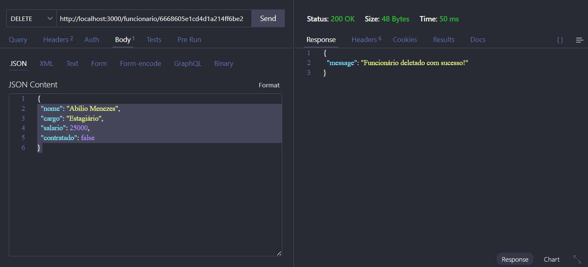

# API DESAFIO LUIZA LABS
Desenvolvimento WEB 3 - 3º DSM FATEC





## Deploy
A aplicação está disponível em: [Render Deploy](https://labs-desafio.onrender.com/funcionario)

## Documentação Swagger
- [SwaggerHub Documentation](https://app.swaggerhub.com/apis/ALLISONRPS/api-funcionarios_labs/1.0.0#/)
- [openapi.json](docs/openapi.json)
- [openapi.yaml](docs/openapi.yaml)

## Iniciando a aplicação
Para iniciar a aplicação localmente, utilize o comando:
```bash
npm run dev
A aplicação estará acessível em: http://localhost:3000

Endpoints

Listando todos os funcionários (GET)

GET /funcionario
Exemplo de resposta:

[
  {
    "_id": "665f9c0d5b69c91029d801db",
    "nome": "Gabriela Dumont",
    "cargo": "Gerente",
    "salario": 15000,
    "contratado": true,
    "__v": 0
  },
  {
    "_id": "665f9c345b69c91029d801dd",
    "nome": "Euclides Abilio",
    "cargo": "Diretor",
    "salario": 50000,
    "contratado": true,
    "__v": 0
  },
  {
    "_id": "665f9cac220be9caccfd8751",
    "nome": "Allison Rodrigues de Paula e Silva",
    "cargo": "Dev Full Stack",
    "salario": 30000,
    "contratado": true,
    "__v": 0
  }
]

-------------------------------------------------------------
Detalhando um funcionário específico (GET)

GET /funcionario/{id}
Exemplo de resposta:

{
  "_id": "665f9cac220be9caccfd8751",
  "nome": "Allison Rodrigues de Paula e Silva",
  "cargo": "Dev Full Stack",
  "salario": 30000,
  "contratado": true,
  "__v": 0
}
-------------------------------------------------------------

Cadastro de funcionário (POST)

POST /funcionario
Corpo da requisição:

{
  "nome": "Clemilda Quitéria",
  "cargo": "Dev Back End",
  "salario": 20000,
  "contratado": true
}

Exemplo de resposta:

{
  "message": "Funcionário criado com sucesso!"
}

-------------------------------------------------------------

Atualizando um funcionário (PUT)

PUT /funcionario/{id}

{
  "nome": "Allison Rodrigues de Paula e Silva",
  "cargo": "Dev Full Stack",
  "salario": 40000,
  "contratado": true
}

Exemplo de resposta:

{
  "_id": "665f9cac220be9caccfd8751",
  "nome": "Allison Rodrigues de Paula e Silva",
  "cargo": "Dev Full Stack",
  "salario": 40000,
  "contratado": true,
  "__v": 0
}

-------------------------------------------------------------

Deletar um funcionário (DELETE)

DELETE /funcionario/{id}

Exemplo de resposta:

{
  "message": "Funcionário deletado com sucesso!"
}

-------------------------------------------------------------